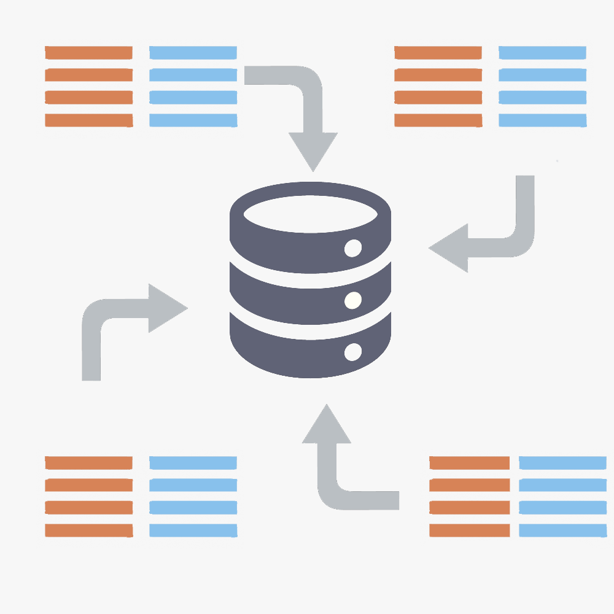
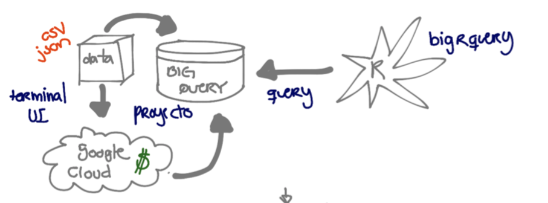
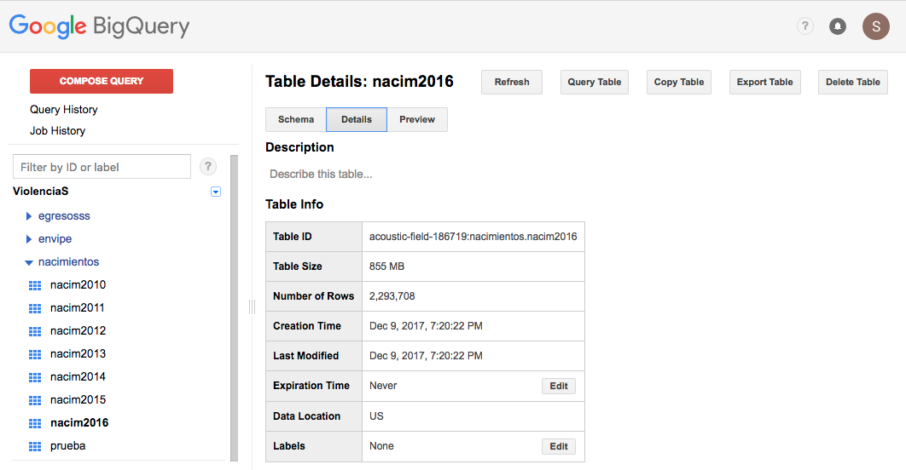
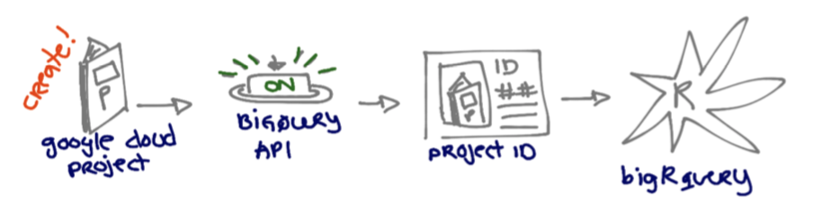
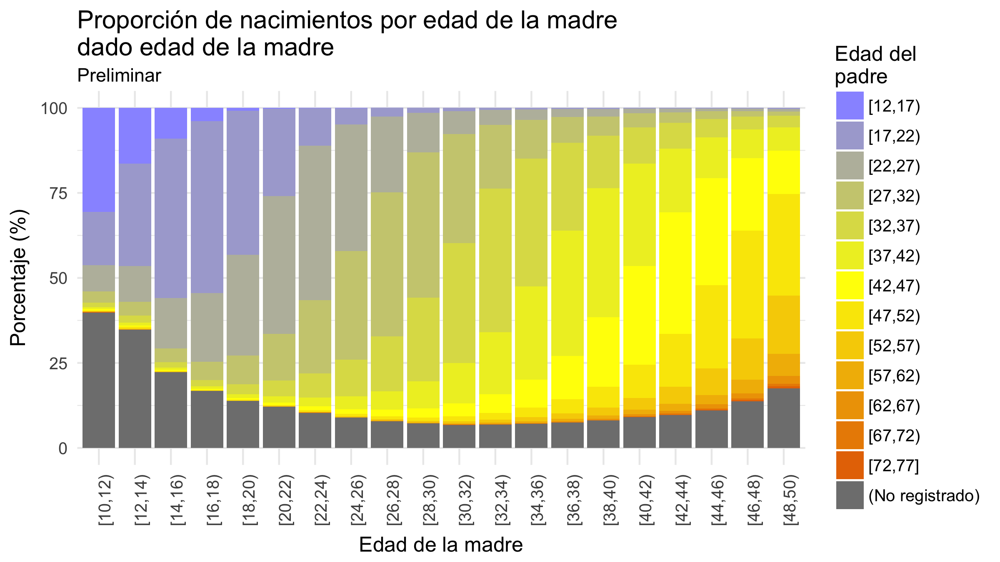

Una aplicación de bigrquery 
========================================================
width: 1440
height: 1200
font-family: 'Helvetica'


16 de febrero de 2018

## Encuentro de usuarios de R 2018


Sonia Mendizábal

</img>

</img>


Introducción
========================================================

**Objetivo:** Obtener la proporción de nacimientos por edad de la madre dado la edad del padre de 2010 a 2016. 

</img>

**Datos:** Estadísticas de nacimientos de 2010 a 2016. INEGI.

</img>


**Problema:** Cada tabla tiene más de dos millones de renglones, aproximadamente 14,000,000 observaciones. 

- R solo si tienes muchas paciencia.
- Varias personas en el equipo con diferentes tareas. 

**Herramientas:** Google BigQuery, R y `bigrquery`.


========================================================


# 1. Google BigQuery.


Google BigQuery
========================================================

- ¿Qué es?

> Almacén de datos (*data warehouse*) empresariales rápido, económico y totalmente administrado para analizar datos a gran escala.

- ¿Qué hace?

    > - Permite realizar consultas SQL **muy** rápidas. 
    > - Utiliza la capacidad de procesamiento de la infraestructura de Google. 
    > - Escanea terabytes en cuestión de segundos y petabytes en cuestión de minutos.

- ¿Cómo se accede?

> Existe una interfaz de usuario web, la línea de comandos o haciendo llamadas a la API.





¿Cómo lo usamos?
========================================================




<small>Puedes cargar los datos desde Google Cloud Storage o Google Cloud Datastore o   transmitirlos a BigQuery para permitir analizarlos en tiempo real.</small>





========================================================


# 2. bigrquery 


> Proporciona una interfaz en R para Google BigQuery.


Por ejemplo:
========================================================

a) Llamamos la librería:


```r
library(bigrquery)
```

b) Definir el id del proyecto (*Project ID*):




```r
# Proyecto ----
project <- "acoustic-field-186719" # put your project ID here
```

c) Hacemos una consulta:

```r
query_exec(query = "SELECT  filenom, ANO_REG, EDAD_MADN, EDAD_PADN FROM [acoustic-field-186719:nacimientos.nacim2016] LIMIT 4", 
           project = project)
```

```
                        filenom ANO_REG EDAD_MADN EDAD_PADN
1 natalidad_base_datos_2016_dbf    2016        36        38
2 natalidad_base_datos_2016_dbf    2016        36        45
3 natalidad_base_datos_2016_dbf    2016        35        38
4 natalidad_base_datos_2016_dbf    2016        35        37
```


========================================================


# 3. Aplicación


> **Objetivo:** Obtener la proporción de nacimientos por edad de la madre dado la edad del padre de 2010 a 2016. 

> **Datos:** Estadísticas de nacimientos de 2010 a 2016. INEGI.


Número de nacimientos por edad del padre y madre de 2010 a 2016. 
========================================================


```r
library(tidyverse)
library(forcats)
```


```r
query_nacims <- lapply(2010:2016, function(year.nom){
  # print(year.nom)
  sql <- paste0("SELECT  COUNT(filenom), ANO_REG, EDAD_MADN", 
                ", EDAD_PADN FROM [acoustic-field-186719:nacimientos.nacim", 
                year.nom,
                "] group by ANO_REG, EDAD_MADN, EDAD_PADN")
  tt <- query_exec(sql, project = project)
  }) 
```


```r
query_nacims[[1]] %>% head
```

```
     f0_ ANO_REG EDAD_MADN EDAD_PADN
1 107447    2010        99        99
2   7166    2010        29        99
3   7225    2010        33        33
4   6163    2010        25        31
5   7350    2010        31        34
6   7450    2010        16        19
```


```r
query_nacims %>% length()
```

```
[1] 7
```


Ir a script
========================================================


Un poco de manipulación
========================================================

```r
df_nacims <- query_nacims %>% 
  bind_rows() %>% 
  as.tibble() %>% 
  rename(count = f0_, ANIO_REG = ANO_REG)  %>% 
  mutate(EDAD_MADN = ifelse(EDAD_MADN == 99, NA, EDAD_MADN),
         EDAD_PADN = ifelse(EDAD_PADN == 99, NA, EDAD_PADN),
         edad_gpo_madre = cut(ifelse(EDAD_MADN == 99, NA, EDAD_MADN), 
                              right = F,
                              breaks = seq(10, 100, by = 2), 
                              include.lowest = T),
         edad_gpo_padre = cut(ifelse(EDAD_PADN == 99, NA, EDAD_PADN), 
                              right = F,
                              breaks = seq(12, 80, by = 5), 
                              include.lowest = T), 
         edad_gpo_madre = fct_explicit_na(edad_gpo_madre, na_level = "(No registrado)"),
         edad_gpo_padre = fct_explicit_na(edad_gpo_padre, na_level = "(No registrado)")) 
df_nacims %>% head
```

```
# A tibble: 6 x 6
   count ANIO_REG EDAD_MADN EDAD_PADN edad_gpo_madre  edad_gpo_padre 
   <int>    <int>     <int>     <int> <fct>           <fct>          
1 107447     2010        NA        NA (No registrado) (No registrado)
2   7166     2010        29        NA [28,30)         (No registrado)
3   7225     2010        33        33 [32,34)         [32,37)        
4   6163     2010        25        31 [24,26)         [27,32)        
5   7350     2010        31        34 [30,32)         [32,37)        
6   7450     2010        16        19 [16,18)         [17,22)        
```


Contamos
========================================================

```r
tab <- df_nacims %>% 
  filter(EDAD_MADN < 50) %>%
  group_by(edad_gpo_madre, edad_gpo_padre) %>% 
  summarise(n_acum = sum(count)) %>% 
  group_by(edad_gpo_madre) %>% 
  mutate( prop = 100*n_acum/sum(n_acum)) %>% 
  ungroup
tab %>% head(10)
```

```
# A tibble: 10 x 4
   edad_gpo_madre edad_gpo_padre n_acum    prop
   <fct>          <fct>           <int>   <dbl>
 1 [10,12)        [12,17)          1054 30.5   
 2 [10,12)        [17,22)           545 15.8   
 3 [10,12)        [22,27)           265  7.67  
 4 [10,12)        [27,32)           112  3.24  
 5 [10,12)        [32,37)            47  1.36  
 6 [10,12)        [37,42)            17  0.492 
 7 [10,12)        [42,47)            17  0.492 
 8 [10,12)        [47,52)             9  0.261 
 9 [10,12)        [52,57)             2  0.0579
10 [10,12)        [57,62)             3  0.0869
```


```r
col.gradient.cut <- c(colorRampPalette(c("#9999ff", "yellow", "#E67400"))(13), 
                      "gray50")
```


Gráfica final
========================================================

```r
tab %>% 
  ggplot(aes(x = edad_gpo_madre, y = prop, fill= edad_gpo_padre)) + 
  geom_bar(stat = "identity") + 
  scale_fill_manual(values = col.gradient.cut) + 
  ylab("Porcentaje (%)") + xlab("Edad de la madre") +
  guides(fill = guide_legend("Edad del\npadre")) +
  ggtitle("Proporción de nacimientos por edad de la madre\ndado edad de la madre", 
          "Preliminar") +
  theme_minimal(base_size = 12) +
  theme(axis.text.x = element_text(angle = 90)) 
```




¡Gracias!
========================================================


### Material, código y presentación:

Github: https://github.com/Songeo/usuariosr_aplicacion_bigrquery.git


### Referencias:

- BigQuery: https://cloud.google.com/bigquery/?hl=es

- `bigrquery`: https://cran.r-project.org/web/packages/bigrquery/index.html

- Estadísticas de natalidad: http://www.beta.inegi.org.mx/proyectos/registros/vitales/natalidad/


### Contacto:

github: [Songeo](https://github.com/Songeo)

email: sonia.gmcl@gmail.com
